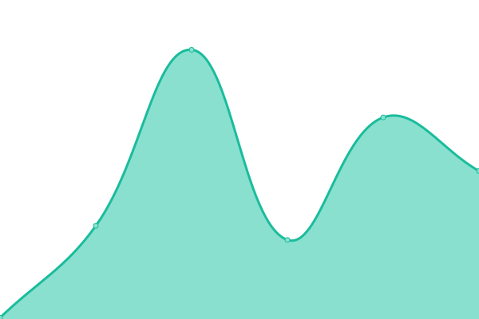

# [📈 Live Status](https://harsh778.github.io/harshsinghal.me-status): <!--live status--> **🟩 All systems operational**

This repository contains the open-source uptime monitor and status page for [Harsh Vardhan Singhal](harshsinghal.me), powered by [Upptime](https://github.com/upptime/upptime).

With [Upptime](https://upptime.js.org), you can get your own unlimited and free uptime monitor and status page, powered entirely by a GitHub repository. We use [Issues](https://github.com/harsh778/harshsinghal.me-status/issues) as incident reports, [Actions](https://github.com/harsh778/harshsinghal.me-status/actions) as uptime monitors, and [Pages](https://harsh778.github.io/harshsinghal.me-status) for the status page.

<!--start: status pages-->
<!-- This summary is generated by Upptime (https://github.com/upptime/upptime) -->
<!-- Do not edit this manually, your changes will be overwritten -->

| URL                                              | Status | History                                                                                                                          | Response Time                                                                              | Uptime                                                                                                                                                                                                                                                                     |
| ------------------------------------------------ | ------ | -------------------------------------------------------------------------------------------------------------------------------- | ------------------------------------------------------------------------------------------ | -------------------------------------------------------------------------------------------------------------------------------------------------------------------------------------------------------------------------------------------------------------------------- |
| [Harsh Vardhan Singhal](https://harshsinghal.me) | 🟩 Up  | [harsh-vardhan-singhal.yml](https://github.com/harsh778/harshsinghal.me-status/commits/master/history/harsh-vardhan-singhal.yml) |  126ms |  |

<!--end: status pages-->

[**Visit our status website →**](https://harsh778.github.io/harshsinghal.me-status)undefined
