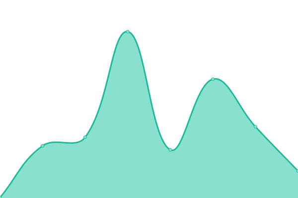

# [📈 Live Status](https://harsh778.github.io/harshsinghal.me-status): <!--live status--> **🟧 Partial outage**

This repository contains the open-source uptime monitor and status page for [Harsh Vardhan Singhal](https://harshsinghal.me).

<!--start: status pages-->
<!-- This summary is generated by Upptime (https://github.com/upptime/upptime) -->
<!-- Do not edit this manually, your changes will be overwritten -->
<!-- prettier-ignore -->
| URL | Status | History | Response Time | Uptime |
| --- | ------ | ------- | ------------- | ------ |
|  [Harsh Vardhan Singhal](https://harsh778.github.io) | 🟩 Up | [harsh-vardhan-singhal.yml](https://github.com/harsh778/status/commits/HEAD/history/harsh-vardhan-singhal.yml) | 

 118ms
     
 | 

<a href="https://harsh778.github.io/status/history/harsh-vardhan-singhal">100.00%</a>
    

|  [V1 of Personal Website](https://harsh.cf) | 🟥 Down | [v1-of-personal-website.yml](https://github.com/harsh778/status/commits/HEAD/history/v1-of-personal-website.yml) | 

 0ms
     
 | 

<a href="https://harsh778.github.io/status/history/v1-of-personal-website">0.00%</a>
    

|  [The Programmer's Hangout](https://theprogrammershangout.com) | 🟩 Up | [the-programmer-s-hangout.yml](https://github.com/harsh778/status/commits/HEAD/history/the-programmer-s-hangout.yml) | 

 250ms
     
 | 

<a href="https://harsh778.github.io/status/history/the-programmer-s-hangout">100.00%</a>
    

<!--end: status pages-->

[**Visit the status website →**](https://harshsinghal.me/harshsinghal.me-status)

## 📄 License

- Code: [MIT](./LICENSE)
- Data in the `./history` directory: [Open Database License](https://opendatacommons.org/licenses/odbl/1-0/)
